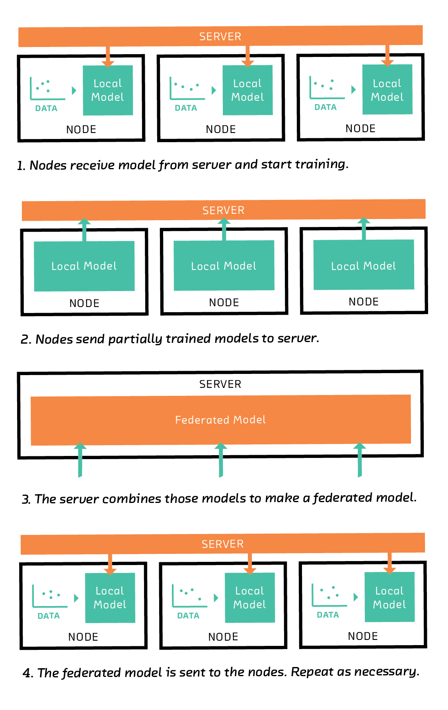

# The Essence Of Quantum Computing

Quantum computing is a buzzword which is being circulated throughout the internet. Often when encountered it seems to emit some arcane aura and has garnered the interest of many people. This topic is something that cannot be explained in a few articles as many people have dedicated their lives trying to uncover its mysteries. I will try to give an abstract overview of this topic. Qubits are the building blocks for Quantum Computers like classical bits are for the current computing devices. Classical bits either exist in the state of ***1 => ON*** or ***0 => OFF***. However, Quantum bits exist in a simultaneous combination of 0 and 1 (superposition). Simply speaking in quantum computing we use the weirdness of quantum mechanics to solve problems that classical computers cannot \[1]. It leverages the following three quantum mechanical properties to do so \[2]:

***Quantum Superposition***: A qubit can exist in a combination of multiple states at the same time. Thus classical bit can hold a value of 0/1 whereas a qubit holds a superimposition of both the values.

***Quantum Entanglement***: For a group entangled of particles/qubits the state of one particle cannot be described without the state of the other particle. Conversely, if you know the state of one particle, however far apart the other particle is, you can infer its state! This property is used for teleporting a Qubit! (Yes teleportation is not fiction anymore!)

***Quantum Interference***: The probabilistic amplitudes of particles/qubits can interfere with each other to create peaks and crests.

In many of the Quantum Circuits, the property of Superposition is used to create a superimposed quantum state of all the possible solutions for the problems. Then quantum interference is used destructively to negate all the wrong solutions so that we are only left with our desired solution. I know it’s a lot to take in! Many of the current challenging problems like drug design and discovery, simulation of physical and quantum mechanical systems, logistics and scheduling, quantum machine learning, etc can be solved by quantum computers \[3]. Recently there have been great strides in the development of quantum computers and a universal quantum computer can be possible in the next 20–30 years.

This does not mean that quantum computers will entirely replace all computing devices. They are only useful for computation in certain cases where the phenomenon of Quantum mechanics can be used to speed up the computation. In other cases, a normal classical computer will be more practical to use. If you want a more elaborate an in-depth understanding of QC check out the links below:

*Link1*: <https://quantum.country/qcvc>

*Link2 (More Practical)*: <https://www.youtube.com/watch?v=Rs2TzarBX5I&list=PLOFEBzvs-VvrXTMy5Y2IqmSaUjfnhvBHR>

Classical Bit vs Qubit \[6]

# **The Essence Of Machine Learning**

Machine learning algorithms are heuristics-based algorithms! They approximate the solution rather than creating a full-blown, accurate, and absolute prediction. This enables them to do predictions in polynomial time with some errors. Creating an ML/DL model has roughly three steps:

• Using an Inner architecture to represent the knowledge, eg: Neural Networks, Support Vector Machines, Decision trees, etc.\
• Creating an Evaluation function to evaluate algorithm metrics like cost/ accuracy/error margin etc.\
• Creating an Optimization function to optimize the algorithm parameters and get the highest possible evaluation score (lowest error).

In most supervised machine learning (ML) problems we are given a sample of data points. Each of these datapoints labels belong to a finite number of classes. These data points are then divided into the training and testing dataset. The training dataset is used to map these data points in a higher dimension to the designated prediction label using a desired inner architecture with a set of parameters or weights. Optimization techniques are used to minimize the mapping error (loss) by tuning the parameters to create the best fit model.

Let us revise the concept of conditional probability as it will be important to us in the further sections. Conditional probability means the probability of an event happening given that another event or set of events has occurred.

> Eg: **P(A|BC)** => Probability that an event A occurs given that an event B and C have occurred.

According to Computer Scientist Peter Wittek, who was a visionary in the field of Quantum Machine Learning \[4]:

> “In any heuristics based ML model when we try to map a datapoint with various parameters to its corresponding label, what we are doing effectively is trying to find the conditional probability ***P(Label|Parameters)***. Hence the model is trying to find the approximate conditional probability distribution of the ***P(L|P1, P2…PN)*** where P is the parameter and L is the label.”

Deep learning (DL) models make use of highly dense neural networks with multiple hidden layers. These models have an architecture with a large number of parameters (weights) in an arbitrarily high dimensional space. This highly complex and large parameter space helps in approximating complex physical processes.

# Federated Learning

***Problem with data**:* Generally speaking to train a machine learning model we need to procure the data points, do some exploratory data analysis, choose the model, and then train it. One of the most important steps in this whole process from a practitioner’s POV is procuring clean, labeled data. As models nowadays keep on growing in size with millions of data points and a large number of parameters, procuring all this data for our single training machine or GPU cluster becomes impractical.

***Privacy***: Real scale machine learning models require a huge amount of well-represented data with a minimum bias for creating an efficient real-world solution. However many of the times this data is private/sensitive and thus data leaks can prove to be detrimental. Many real-world problems require user data from edge devices like smartphones, health-ware, IOT based edge devices, etc (eg: Google uses keyboard input data for improving its word prediction model). However, the sensitive nature of this data and the multiple adversaries at each step make it impossible to transfer it safely to the main server for training. No one likes to share their personal data, so many users opt-out of data sharing as a privacy measure. In other cases, companies and research institutes will avoid sharing sensitive data to prevent leaks to competitors/uninvolved parties. Such data may include the patient’s medical history, research data, companies’ financial data, etc.

***Computation Costs***: Let’s suppose we get all the data! But what about training? Training a dataset with millions of data points with a large parameter space requires huge computational resources and creates overhead costs. OpenAI’s revolutionary GPT-3 model was trained using high bandwidth GPU clusters provided by Microsoft for a whopping cost of approximately 5 million dollars. Large scale companies with funding can afford it, but at what cost? If training a single model requires such a large cost then online learning models, as well as models with feedback loops, are out of the question!

***Federated Learning to the rescue***: Federated learning (FL) can solve all these problems! But how? Let’s see how it solves each of these problems. In Federated learning a federation of nodes act as local computing devices (any edge computing device) to train a model. The data is locally available in these edge devices in the form of user data/time series etc. The parameter server (main server ) has the model to be trained. Initially, it is pretrained with some data. Then this model is sent by the server to a subset of participating devices. This subset is optimally selected to prevent any data bias/misrepresentation. Once the local node receives a model it uses its computing power to train the model for a few iterations. As discussed earlier a deep learning model is trained using various parameters also called weights. These weights are tuned to give a model with a minimum error while prediction. Once trained all the nodes send back the model to the parameter server in the form of weight updates. Rather than sending a full-blown model, the nodes sends back the weights changes that serve the same purpose as an updated model. Once all the weight updates are received a federated average is taken at the server which simply means that a weighted average of all the updated coefficients is taken where updates from nodes with higher data points are given preference. This federated average is then used to update the main model. However, our goal is to converge towards a model with weights resulting in minimum error while prediction. Thus after each iteration of federated averaging the models are sent back to the nodes for further training (similar to mini-batch gradient descent). Thus after a large number of iterations, we reach convergence. During training devices that have communication issues/drop off from the process can be replaced with different nodes. This way data privacy is maintained as no data transfer takes place whilst computing a distributed model update with very less power consumption for the main server \[5].

Steps in Federated Learning \[7]

> Some links to get a better idea of federated learning:

*Link1 :* <https://ai.googleblog.com/2017/04/federated-learning-collaborative.html>

*Link2 :* <https://federated.withgoogle.com/#learn>

# Quantum Machine Learning

As Quantum Computing forays into a spectrum of technologies, Quantum machine learning was an obvious choice! Why? This is because inherently both ML/DL models and Quantum circuits represent probability distributions. Qubits represent the wave nature of matter and ML/DL models represent conditional probability distributions. So does that mean Quantum Computers can train Deep learning models in a few minutes? As we discussed earlier deep learning models have millions of parameters/weights which need to be represented for further tuning. However, the maximum number of Qubits current Quantum computers can handle is 2000 Qubits. On top of that today we are in the NISQ (Noisy Intermediate Scale Quantum Computing) era. Simply speaking it means that we have quantum computers that can do what classical computers can’t do but we don’t have enough qubits to spare for correcting the inherent errors in the system. You may ask what errors? Every quantum circuit evaluation adds some noise to the circuit which grows exponentially with the number of qubits. This requires error correction quantum algorithms for denoising. As we cant construct large-scale qubit systems the workaround used today is Variational quantum circuits wherein the classical computing part is used to mitigate the error in the circuit.

So is it useful? Practical? Although we cannot use it to create deep neural networks or other complex models in its current state, it is certainly possible in the near future! Currently, the best way to use QML is for optimizing or creating models with a manageable number of tunable parameters.

The main steps for formulating any QML problem are as follows:

• Identify a problem with a discrete number of tunable parameters that can be optimized.\
• Encode the classical data as quantum data, i.e data interpretable by Quantum Circuits.\
• Create a Variational Quantum Circuit (Self error correcting circuit) to represent the model architecture and its corresponding loss function (Error function) for the given parameters.\
• Use an appropriate quantum optimization algorithm to find the parameters with the lowest error/highest level of approximation also called the ground state solution for the model.

Some Quantum models that work on this principle are Qboost (Algorithm based on Adaboost), Clustering with Quantum Optimization, Kernel methods, etc. These names may seem confusing to you but just think of them as supplementary information.

***Some more insight into the Scope of QML and optimization***:

Training an AI-based model will take a lot of time and GPU power as a large amount of data needs to be processed, trained, and optimized. During the optimization state, the solution with the lowest error has to be picked from an exponentially large set of possible solutions. One way to find solutions with low error is to use Quantum Annealing which uses quantum mechanics to find solutions with the lowest energy. The Quantum approximation optimization algorithm is one of its applications where approximation techniques are used to find solutions with minimum loss. Also, the property of quantum interference can be used at the optimization stage to create destructive interference which negates all the solutions with high error, and solutions with low error can be measured. These techniques should effectively reduce training time exponentially as Quantum computers can use superposition and interference to work on many qubits simultaneously to solve exponential problems in linear time! In general, reduced training time would be highly beneficial for quick deployment/redeployment of continuous learning DL systems. This should be highly viable in case of very large models with millions of parameters, albeit it’s not possible due to the limitations of current Quantum Systems as explained above. The property of superposition enables us to represent exponential classical training data as a small amount of quantum data. Thus we can use quantum circuits as coprocessors that work in tandem with other solutions to complement them and increase their effectiveness.

> Some links to get a better idea of Quantum Machine Learning:

*Link1 :* <https://www.youtube.com/playlist?list=PLmRxgFnCIhaMgvot-Xuym_hn69lmzIokg>

*Link2:* <https://pennylane.ai/qml/index.html>

# The Difference. When to use what? Is one better than the other?

It may seem that in terms of raw computing power Quantum Computing surpasses Federated Learning. Federated Learning only distributes the computing and power consumption overhead to its group of federated nodes. However, the actual computing power used will be at least more or less than what it would be if the model was trained on the main server. If a Quantum Circuit can be prepared to solve the same problem, exponential improvement can be made. However herein lies the difficulty! The formulated problem should be feasible to be solved by QML! Currently, in this NISQ era, the aforementioned problems prove to be a hurdle to implement a practical quantum circuit for large scale data optimization and modeling. Although in the future Quantum Circuits may be feasible in terms of the cost, computation, and error correction and prove to be exponentially faster than FL whilst consuming minimum power, today one of the best practical solutions for distributed machine learning is FL. It’s ability to distribute computation and power while maintaining data privacy during model training makes it practical for today’s use cases. Add in some incentivization and support for other edge devices the overheads can be exponentially reduced. Most of the diverse collection of data required for training is already held by the so-called four horsemen or FANG (Facebook, Amazon, Netflix, and Google) companies! Also, these companies will be one of the first to create practical QML models. Thus quantum inherently been a centralized model will give more power in their hands! One technology is not better than the other and each one is suitable for a particular use case, but FL seems to have the edge in the market due to its practicality. We are heading towards a Quantum future but for scalable, practical, and cost-efficient solutions we need to adopt a coprocessor based architecture for QML. What do you think? Write your thoughts in the comments below!

# References:

\[1] <https://www.ibm.com/quantum-computing/>

\[2] <https://qiskit.org/textbook/preface.html>

\[3] <https://www.microsoft.com/en-us/quantum>

\[4] <https://www.youtube.com/watch?v=TjVEfusNfVg&t=232s>

\[5] <https://blog.fastforwardlabs.com/2018/11/14/federated-learning-distributed-machine-learning-with-data-locality-and-privacy.html>

# Picture Credits:

\[6] <https://www.austinchronicle.com/screens/2019-04-19/quantum-computing-101-a-beginners-guide-to-the-mind-bending-new-technology/>

\[7] <https://blog.fastforwardlabs.com/2018/11/14/federated-learning-distributed-machine-learning-with-data-locality-and-privacy.html>

# License

All rights reserved. Others cannot copy, distribute, or perform your work without your permission (or as permitted by fair use).